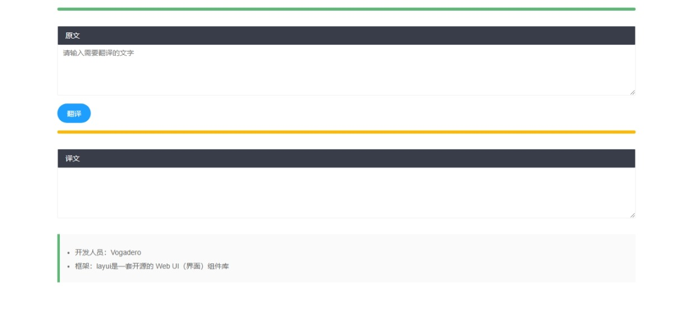

[](https://github.com/Vogadero/translator)


# 项目简介🚩

- 翻译 
- 演示地址：https://vogadero.github.io/translator/

## 1. 功能模块🎨

#### 1.1 首页🛫

| 功能 |
| ---- |
| 翻译 |

## 2. 截图⭐



## 3. 项目架构🍽️

| 系统分层 | 使用技术                    |
| -------- | --------------------------- |
| 客户端   | Art-template、jQuery、layui |

## 4. 项目运行环境搭建🌈

- 克隆远端数据仓库到本地：`git clone 仓库地址`
- 拉取远程仓库中最新的版本：`git pull 远程仓库地址 分支名称`
- 双击index.html

# 功能介绍🦷

## 🕵️‍♀️翻译

- 步骤：先输入原文，再点击翻译，输出译文

- API

  - 地址：https://api.asilu.com/fanyi/

  - 方式：GET

  - 参数类型：jsonp

  - 参数：

    | 参数名 | 说明     |
    | ------ | -------- |
    | q      | 原文内容 |
    | type   | string   |


# Tree🌵    


```
翻译
├─ 01.jpeg
├─ css
│  └─ layui.css
├─ index.html
├─ js
│  ├─ jquery-3.6.0.min.js
│  ├─ layui.js
│  └─ template-web.js
├─ README.md
└─ 语言翻译.ico
```